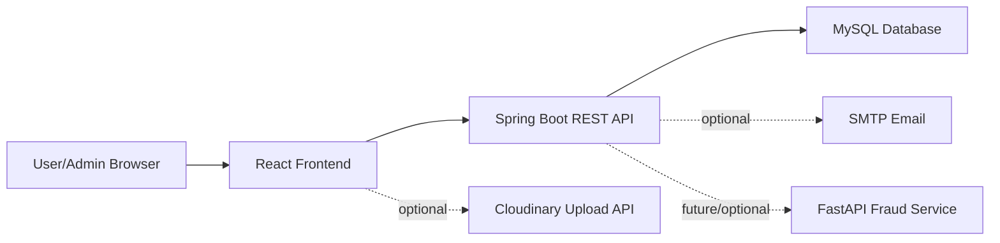

# Loan Verification System

A full-stack fintech-style loan verification platform built with Spring Boot, React, MySQL, JWT authentication, fraud-risk scoring, admin review workflows, charts, audit logs, and optional OTP/email/document-upload integrations.

Repository: https://github.com/tausifalam6879/Loan_Verification_System

## What This Project Does

Loan Verification System helps users register, manage expenses, compare loan offers, submit loan applications with document data, track application status, and view profile/application metrics. Admin users can review applications, inspect full application details, approve or reject loans, monitor risk levels, view analytics charts, and track admin activity through audit logs.

Public registration is locked to the `USER` role. Admin access must be assigned manually from the database or backend side, which matches safer real-world behavior.

## Key Features

- JWT-based login and protected frontend routes.
- Secure registration flow where users cannot self-register as admin.
- Profile page showing name, email, role, total applications, and credit score.
- User dashboard with expense tracking, transactions, investments, loan marketplace, loan applications, and AI assistant.
- Loan marketplace with seeded banks and offers, including SBI, HDFC, ICICI, and Axis comparisons.
- Loan application workflow with Aadhaar, PAN, passport photo/document data, risk signals, status tracking, and payment marker.
- Admin dashboard with application table, details modal, status timeline, approval/rejection actions, charts, fraud-risk monitoring, and audit logs.
- Recharts analytics for loan status, risk distribution, and monthly expenses.
- Optional OTP verification endpoints for account flows.
- OTP controls are hidden in local mode until backend SMTP/OTP settings are enabled.
- Optional email notifications for account and loan-status events.
- Optional Cloudinary document upload support with base64 fallback for local demos.
- Separate FastAPI fraud detection service for AI-style loan-risk scoring.
- API documentation and setup docs included in `docs/`.

## Tech Stack

| Layer | Technology |
| --- | --- |
| Frontend | React, React Router, Material UI, Recharts, Axios |
| Backend | Java, Spring Boot, Spring Security, Spring Data JPA, Validation |
| Database | MySQL |
| Auth | JWT |
| AI/Fraud Service | Python, FastAPI, Pydantic |
| Optional Integrations | SMTP email, Cloudinary unsigned uploads |
| Build/Test | Maven Wrapper, npm, React Testing Library |

## Architecture



## Project Structure

```text
VerificationSystem/
  src/main/java/com/loan/VerificationSystem/
    controller/        REST controllers
    service/           Business logic
    repository/        Spring Data repositories
    entity/            JPA entities
    dto/               Request/response DTOs
    config/            Security, CORS, seed data
    security/          JWT and user-details integration
  src/main/resources/
    application.properties
  frontend/
    src/components/    Dashboard widgets and shared UI
    src/pages/         Auth, dashboard, admin, profile pages
    src/services/      Axios API services
    src/utils/         Upload helpers
  ai-fraud-service/    Optional Python FastAPI risk service
  docs/                Setup, API, and feature documentation
```

## Quick Start

### 1. Database

Create a MySQL database:

```sql
CREATE DATABASE loan_db;
```

Update credentials in `src/main/resources/application.properties` if your MySQL username/password are different.

### 2. Backend

```powershell
.\mvnw.cmd spring-boot:run
```

Backend runs on:

```text
http://localhost:8081
```

Health check:

```text
GET http://localhost:8081/api/users/test
```

### 3. Frontend

```powershell
cd frontend
npm install
npm start
```

Frontend runs on:

```text
http://localhost:3000
```

### 4. Optional Fraud Service

```powershell
cd ai-fraud-service
pip install -r requirements.txt
uvicorn main:app --reload --port 8000
```

Fraud service runs on:

```text
http://localhost:8000
```

## Configuration

Important backend settings are in `src/main/resources/application.properties`.

```properties
server.port=8081
spring.datasource.url=jdbc:mysql://localhost:3306/loan_db?useSSL=false&serverTimezone=UTC&allowPublicKeyRetrieval=true
spring.datasource.username=root
spring.datasource.password=root123
jwt.secret=MySuperSecretKeyForLoanVerificationSystem2026JwtToken
app.otp.enabled=${APP_OTP_ENABLED:false}
app.mail.enabled=${APP_MAIL_ENABLED:false}
```

Optional frontend Cloudinary config can be copied from `frontend/.env.example`:

```env
REACT_APP_CLOUDINARY_CLOUD_NAME=
REACT_APP_CLOUDINARY_UPLOAD_PRESET=
```

When Cloudinary is not configured, the frontend keeps document previews as local base64 data for demo use.

## Documentation

- [Setup Guide](docs/SETUP.md)
- [API Reference](docs/API.md)
- [Feature Documentation](docs/FEATURES.md)
- [Email OTP Setup](docs/EMAIL_OTP.md)
- [Fraud Service README](ai-fraud-service/README.md)

## Verification Commands

Backend:

```powershell
.\mvnw.cmd test
.\mvnw.cmd package
```

Frontend:

```powershell
cd frontend
npm test -- --watchAll=false
npm run build
```

## Security Notes

- Public registration always creates `USER` accounts.
- Admin accounts should be created or promoted manually by an owner/developer.
- Keep `jwt.secret`, database credentials, SMTP password, and Cloudinary settings out of commits.
- OTP and email are disabled by default until SMTP configuration is provided through environment variables.
- CORS is open for local development; restrict origins before production deployment.

## Current Status

Core application flow is implemented: authentication, user dashboard, profile, loan marketplace, application submission, admin review, charts, audit logs, OTP/email-ready backend, document upload helper, and optional fraud service. External production setup still requires real SMTP, Cloudinary, deployment hosting, and production database credentials.
