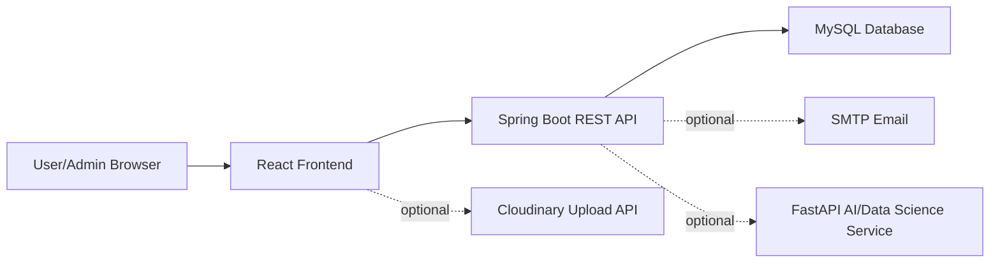

# Loan Verification System

A full-stack fintech-style loan verification platform built with Spring Boot, React, MySQL, JWT authentication, fraud-risk scoring, admin review workflows, charts, audit logs, and optional OTP/email/document-upload integrations.

Repository: https://github.com/tausifalam6879/Loan_Verification_System

Live demo: https://tausifalam6879.github.io/Loan_Verification_System

## What This Project Does

Loan Verification System helps users register, manage expenses, compare loan offers, submit loan applications with document data, track application status, and view profile/application metrics. Admin users can review applications, inspect full application details, approve or reject loans, monitor risk levels, view analytics charts, and track admin activity through audit logs.

Public registration is locked to the `USER` role. Admin access must be assigned manually from the database or backend side, which matches safer real-world behavior.

## Key Features

- JWT-based login and protected frontend routes.
- Secure registration flow where users cannot self-register as admin.
- Profile page showing name, email, role, total applications, and credit score.
- User dashboard with expense tracking, transactions, investments, loan marketplace, loan applications, and AI assistant.
- Loan marketplace with seeded banks and offers, including SBI, HDFC, ICICI, and Axis comparisons.
- Loan application workflow with Aadhaar, PAN, nominee mobile validation, passport photo/document data, risk signals, status tracking, and payment marker.
- Admin dashboard with application table, details modal, status timeline, approval/rejection actions, charts, fraud-risk monitoring, and audit logs.
- Recharts analytics for loan status, risk distribution, and monthly expenses.
- Optional OTP verification endpoints for account flows.
- OTP controls are hidden in local mode until backend OTP settings are enabled.
- Local OTP development fallback logs the OTP in the backend console when SMTP is not enabled.
- Optional email notifications for account and loan-status events.
- Optional Cloudinary document upload support with base64 fallback for local demos.
- Separate FastAPI AI/Data Science service for loan-risk scoring, ML expense categorization, expense forecasting, anomaly detection, and saving recommendations.
- Optional live AI chat integration through OpenAI, Gemini, or local Ollama, with API keys kept only in backend environment variables.
- API documentation and setup docs included in `docs/`.

## Live Demo

The GitHub Pages live demo runs the React frontend in demo mode with sample data, so recruiters can open the dashboard without a local Spring Boot/MySQL backend.

Demo URL:

```text
https://tausifalam6879.github.io/Loan_Verification_System
```

Use any email/password on the login page. Use an email containing `admin`, for example `admin@demo.com`, to open the admin dashboard demo.

## Tech Stack

| Layer | Technology |
| --- | --- |
| Frontend | React, React Router, Material UI, Recharts, Axios |
| Backend | Java, Spring Boot, Spring Security, Spring Data JPA, Validation |
| Database | MySQL |
| Auth | JWT |
| AI/Data Science Service | Python, FastAPI, Pandas, Scikit-learn, TF-IDF, Logistic Regression, Joblib |
| Optional Integrations | SMTP email, Cloudinary unsigned uploads |
| Build/Test | Maven Wrapper, npm, React Testing Library |

## Architecture



## Project Structure

```text
VerificationSystem/
  src/main/java/com/loan/VerificationSystem/
    controller/        REST controllers
    service/           Business logic
    repository/        Spring Data repositories
    entity/            JPA entities
    dto/               Request/response DTOs
    config/            Security, CORS, seed data
    security/          JWT and user-details integration
  src/main/resources/
    application.properties
  frontend/
    src/components/    Dashboard widgets and shared UI
    src/pages/         Auth, dashboard, admin, profile pages
    src/services/      Axios API services
    src/utils/         Upload helpers
  ai-fraud-service/    Optional Python FastAPI ML service
  docs/                Setup, API, and feature documentation
```

## Quick Start

### 1. Database

By default the backend uses a local file-based H2 database in `data/verification_system_local` so the project runs without MySQL password setup and keeps users/expenses after backend restarts.

If you want MySQL, create a MySQL database:

```sql
CREATE DATABASE loan_db;
```

Then run the backend with the `mysql` profile and set credentials:

```powershell
$env:MYSQL_USERNAME="root"
$env:MYSQL_PASSWORD="your-mysql-password"
java -jar target\VerificationSystem-0.0.1-SNAPSHOT.jar --spring.profiles.active=mysql
```

### 2. Backend

```powershell
.\mvnw.cmd spring-boot:run
```

Backend runs on:

```text
http://localhost:8081
```

Health check:

```text
GET http://localhost:8081/api/users/test
```

For local demo without MySQL, build once and run:

```powershell
.\mvnw.cmd package -DskipTests
.\start-backend.ps1
```

To enable email OTP in local mode, start the backend with OTP enabled. If SMTP is not configured, the OTP is written to `target/backend-run.log`:

```powershell
$env:APP_OTP_ENABLED="true"
.\start-backend.ps1
```

The React frontend never calls Ollama, Gemini or OpenAI directly. It only calls the backend endpoint `POST /api/ai/chat`; the backend picks the provider from `LLM_PROVIDER`.

For local development with Ollama:

```powershell
$env:LLM_PROVIDER="ollama"
$env:OLLAMA_BASE_URL="http://localhost:11434"
$env:LLM_MODEL="llama3.2:3b"
$env:LLM_TIMEOUT_MS="15000"
.\start-backend.ps1
```

For a public demo/deployment with Gemini:

```powershell
$env:LLM_PROVIDER="gemini"
$env:GEMINI_API_KEY="your-gemini-api-key"
$env:LLM_MODEL="gemini-1.5-flash"
$env:LLM_TIMEOUT_MS="15000"
.\start-backend.ps1
```

For a public demo/deployment with OpenAI:

```powershell
$env:LLM_PROVIDER="openai"
$env:OPENAI_API_KEY="sk-your-openai-key"
$env:LLM_MODEL="gpt-4o-mini"
$env:LLM_TIMEOUT_MS="15000"
.\start-backend.ps1
```

To use Odysseus or another OpenAI-compatible local `/v1` endpoint:

```powershell
$env:LLM_PROVIDER="openai-compatible"
$env:LOCAL_LLM_BASE_URL="http://localhost:7000/v1"
$env:LOCAL_LLM_API_KEY=""
$env:LLM_MODEL="your-local-model-name"
.\start-backend.ps1
```

If `LLM_PROVIDER` is left as `local`, the chatbox uses backend analytics only. If `LLM_PROVIDER=ollama` and Ollama is not running, the backend returns `Local LLM service is not running. Please start Ollama and try again.` If `LLM_PROVIDER=gemini` or `LLM_PROVIDER=openai` has no API key, the backend returns `AI service is not configured. Please add API key in backend environment variables.`

Public users do not need Ollama when the deployed backend is configured with Gemini or OpenAI. Ollama is only required for local/offline LLM mode.

For real Gmail email OTP delivery, use a Gmail App Password:

```powershell
$env:APP_OTP_ENABLED="true"
$env:APP_MAIL_ENABLED="true"
$env:SMTP_USERNAME="yourgmail@gmail.com"
$env:SMTP_PASSWORD="your-gmail-app-password"
.\start-backend.ps1
```

For real SMS/WhatsApp OTP delivery, configure a Twilio-compatible account:

```powershell
$env:APP_OTP_ENABLED="true"
$env:APP_SMS_ENABLED="true"
$env:APP_WHATSAPP_ENABLED="true"
$env:TWILIO_ACCOUNT_SID="ACxxxxxxxxxxxxxxxxxxxxxxxxxxxxx"
$env:TWILIO_AUTH_TOKEN="your_twilio_auth_token"
$env:TWILIO_SMS_FROM="+1234567890"
$env:TWILIO_WHATSAPP_FROM="whatsapp:+14155238886"
.\start-backend.ps1
```

### 3. Frontend

```powershell
cd frontend
npm install
npm start
```

Frontend runs on:

```text
http://localhost:3000
```

### 4. Optional AI/Data Science Service

```powershell
.\start-ai-service.bat
```

Or run it manually:

```powershell
cd ai-fraud-service
python -m venv .venv
.\.venv\Scripts\activate
pip install -r requirements.txt
uvicorn main:app --reload --port 8000
```

AI service runs on:

```text
http://localhost:8000
```

Spring Boot calls it through:

```text
POST http://localhost:8081/api/ai/expenses/category
```

## Configuration

Important backend settings are in `src/main/resources/application.properties`.

```properties
server.port=8081
spring.datasource.url=jdbc:h2:file:./data/verification_system_local;MODE=MySQL;DATABASE_TO_LOWER=TRUE;AUTO_SERVER=TRUE
spring.datasource.username=sa
spring.datasource.password=
jwt.secret=MySuperSecretKeyForLoanVerificationSystem2026JwtToken
app.otp.enabled=${APP_OTP_ENABLED:true}
app.otp.console-fallback.enabled=${APP_OTP_CONSOLE_FALLBACK_ENABLED:true}
app.llm.provider=${LLM_PROVIDER:local}
app.llm.model=${LLM_MODEL:}
app.llm.timeout-ms=${LLM_TIMEOUT_MS:15000}
app.llm.openai-api-key=${OPENAI_API_KEY:}
app.llm.gemini-api-key=${GEMINI_API_KEY:}
app.llm.ollama-base-url=${OLLAMA_BASE_URL:http://localhost:11434}
app.llm.local-base-url=${LOCAL_LLM_BASE_URL:http://localhost:11434/v1}
app.llm.local-api-key=${LOCAL_LLM_API_KEY:}
app.mail.enabled=${APP_MAIL_ENABLED:false}
```

Optional frontend Cloudinary config can be copied from `frontend/.env.example`:

```env
REACT_APP_CLOUDINARY_CLOUD_NAME=
REACT_APP_CLOUDINARY_UPLOAD_PRESET=
```

When Cloudinary is not configured, the frontend keeps document previews as local base64 data for demo use.

## Documentation

- [Setup Guide](docs/SETUP.md)
- [API Reference](docs/API.md)
- [Feature Documentation](docs/FEATURES.md)
- [Email OTP Setup](docs/EMAIL_OTP.md)
- [Fraud Service README](ai-fraud-service/README.md)
- [Postman Auth and OTP Collection](docs/postman-auth-otp-collection.json)

## Verification Commands

Backend:

```powershell
.\mvnw.cmd test
.\mvnw.cmd package
```

Frontend:

```powershell
cd frontend
npm test -- --watchAll=false
npm run build
```

## Security Notes

- Public registration always creates `USER` accounts.
- Admin accounts should be created or promoted manually by an owner/developer.
- Keep `jwt.secret`, database credentials, SMTP password, and Cloudinary settings out of commits.
- OTP is disabled by default. When OTP is enabled without SMTP, the development fallback logs the OTP in the backend console. For real email delivery, enable SMTP through environment variables.
- CORS is open for local development; restrict origins before production deployment.

## Current Status

Core application flow is implemented: authentication, user dashboard, profile, loan marketplace, application submission, admin review, charts, audit logs, OTP/email-ready backend, document upload helper, and optional fraud service. External production setup still requires real SMTP, Cloudinary, deployment hosting, and production database credentials.
