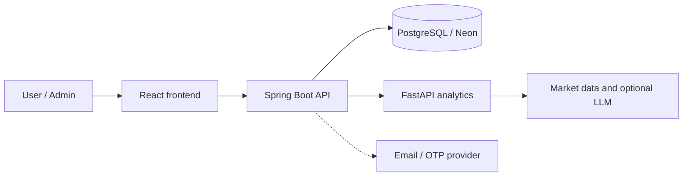

# FinTrack — Loan Verification System

A full-stack application for managing expenses, comparing loan offers and tracking loan applications. Users manage their finances; administrators review applications with risk signals and an audit trail.

[Open the application](https://tausifalam6879.github.io/Loan_Verification_System/) · [System design](docs/SYSTEM_DESIGN.md) · [Setup guide](docs/SETUP.md) · [API guide](docs/API.md)

## What you can do

- **Account:** register, sign in, manage your profile and use configured verification methods.
- **Expenses:** record spending, review categories and track budgets.
- **Loans:** compare offers, submit application details/documents and track review status.
- **Admin review:** inspect applications, approve or reject them, and review audit logs.
- **Insights:** explore savings estimates, expense analysis, market research and AI explanations.

Payments are a **simulation**, not real money transfers. Seeded loan offers and risk scores are project features, not bank approval guarantees.

## System at a glance


```mermaid
flowchart LR
    Browser["User / Admin"] --> UI["React frontend"]
    UI --> API["Spring Boot API"]
    API --> DB[("PostgreSQL / Neon")]
    API --> AI["FastAPI analytics"]
    API -.-> Mail["Email / OTP provider"]
    AI -.-> Data["Market data and optional LLM"]
```

React displays the interface. Spring Boot owns authentication, permissions and business data. FastAPI provides analytics; it does not replace the application's review workflow.

See the [system design](docs/SYSTEM_DESIGN.md) for request flows, database relationships, deployment and security boundaries.

## Technology

| Part | Technology |
| --- | --- |
| Interface | React, Material UI, Recharts |
| Application API | Java 21, Spring Boot, Spring Security, JWT, JPA |
| Database | H2 locally; PostgreSQL/Neon in the cloud; optional MySQL profile |
| Analytics | Python, FastAPI, pandas, scikit-learn |
| Hosting | GitHub Pages frontend; Google Cloud Run services |

## Run locally

Install Java 21, Node.js/npm and, for analytics, Python. Run each service in a separate terminal from the repository root.

**1. Start the backend**

```powershell
.\mvnw.cmd spring-boot:run
```

The API runs on port **8081**. The default H2 database is in memory: local data is lost when the backend stops. No MySQL installation is required for this mode.

**2. Start the frontend**

```powershell
cd frontend
npm install
$env:REACT_APP_DEMO_MODE="false"
$env:REACT_APP_API_BASE_URL="http://localhost:8081/api"
npm start
```

Open [the local frontend](http://localhost:3000/Loan_Verification_System/).

**3. Start analytics (optional for basic account/loan screens)**

```powershell
cd ai-fraud-service
python -m venv .venv
.\.venv\Scripts\Activate.ps1
pip install -r requirements.txt
uvicorn main:app --reload --port 8000
```

Database profiles, email setup and troubleshooting are in the [setup guide](docs/SETUP.md).

## Deployment and demo modes

- **Full stack:** GitHub Pages calls the Cloud Run API, which stores accounts and application data in Neon.
- **Browser demo:** when built in demo mode, data stays in browser storage. This is not production authentication or shared database storage.
- **Cloud deployment:** [deploy_google_cloud.sh](scripts/deploy_google_cloud.sh) deploys the API and analytics services. Review its project/database defaults before running it in Cloud Shell.
- Set the frontend's `REACT_APP_API_BASE_URL` to the deployed API URL ending in `/api`. Keep database passwords, JWT secrets and provider keys server-side.

The deployment script creates billable cloud resources. Its minimum-instance settings can incur charges even when the site is idle.

## Project map

| Directory | Contents |
| --- | --- |
| `frontend/` | Pages, components and API clients |
| `src/main/java/com/loan/VerificationSystem/` | Controllers, services, entities, repositories and security |
| `src/main/resources/` | Runtime configuration and database profiles |
| `ai-fraud-service/` | Analytics, market research and model code |
| `scripts/` | Deployment and maintenance helpers |
| `docs/` | Setup, API and system documentation |

## Tests

```powershell
# From the repository root
.\mvnw.cmd test

# From frontend/
npm test -- --watchAll=false
npm run build
```

## More documentation

- [System design](docs/SYSTEM_DESIGN.md) — architecture, data ownership and main flows.
- [Setup](docs/SETUP.md) — local services and configuration.
- [API](docs/API.md) — endpoints and request examples.
- [Email OTP](docs/EMAIL_OTP.md) — delivery configuration.
- [Authenticator setup](docs/AUTHENTICATOR_SETUP.md) — authenticator integration.
- [AI service](ai-fraud-service/README.md) — analytics implementation.

Market insights and investment projections are educational estimates, not financial advice.
