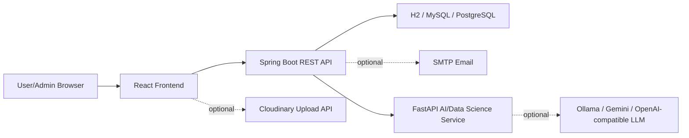

# Loan Verification System

A full-stack fintech-style loan verification platform built with Spring Boot, React, MySQL, JWT authentication, fraud-risk scoring, admin review workflows, charts, audit logs, and optional OTP/email/document-upload integrations.

Repository: https://github.com/tausifalam6879/Loan_Verification_System

Live demo: https://tausifalam6879.github.io/Loan_Verification_System

## What This Project Does

Loan Verification System helps users register, manage expenses, compare loan offers, submit loan applications with document data, track application status, and view profile/application metrics. Admin users can review applications, inspect full application details, approve or reject loans, monitor risk levels, view analytics charts, and track admin activity through audit logs.

Public registration is locked to the `USER` role. Admin access must be assigned manually from the database or backend side, which matches safer real-world behavior.

## Key Features

- JWT-based login and protected frontend routes.
- Secure registration flow where users cannot self-register as admin.
- Profile page showing name, email, role, total applications, and credit score.
- User dashboard with expense tracking, transactions, investments, loan marketplace, loan applications, and AI assistant.
- Loan marketplace with seeded banks and offers, including SBI, HDFC, ICICI, and Axis comparisons.
- Loan application workflow with Aadhaar, PAN, nominee mobile validation, passport photo/document data, risk signals, status tracking, and payment marker.
- Admin dashboard with application table, details modal, status timeline, approval/rejection actions, charts, fraud-risk monitoring, and audit logs.
- Recharts analytics for loan status, risk distribution, and monthly expenses.
- Optional OTP verification endpoints for account flows.
- OTP controls are hidden in local mode until backend OTP settings are enabled.
- Local OTP development fallback logs the OTP in the backend console when SMTP is not enabled.
- Optional email notifications for account and loan-status events.
- Optional Cloudinary document upload support with base64 fallback for local demos.
- Separate FastAPI AI/Data Science service for loan-risk scoring, ML expense categorization, expense forecasting, anomaly detection, and saving recommendations.
- Global market workspace covering major US, European, Indian, and Asian indices plus custom Yahoo Finance symbols.
- Next-session probabilistic outlook using technical features, Logistic Regression, chronological backtesting, news factors, and an Ollama research agent.
- API documentation and setup docs included in `docs/`.

## Live Demo

GitHub Pages hosts only the React frontend. The production build calls the deployed Spring Boot API, which uses PostgreSQL and the deployed FastAPI market/ML service. The deployment intentionally fails if the `REACT_APP_API_BASE_URL` repository variable is missing, preventing a broken localhost-only release.

Demo URL:

```text
https://tausifalam6879.github.io/Loan_Verification_System
```

Register a normal user through the live backend. Admin roles must be assigned from the backend/database; the public build does not enable the local demo adapter.

## Tech Stack

| Layer | Technology |
| --- | --- |
| Frontend | React, React Router, Material UI, Recharts, Axios |
| Backend | Java, Spring Boot, Spring Security, Spring Data JPA, Validation |
| Database | H2 (local default), MySQL (optional local profile), PostgreSQL (production) |
| Auth | JWT |
| AI/Data Science Service | Python, FastAPI, Pandas, Scikit-learn, TF-IDF, Logistic Regression, Joblib |
| Optional Integrations | SMTP email, Cloudinary unsigned uploads |
| Market GenAI | yfinance market history, Scikit-learn model, Ollama/Gemini/OpenAI-compatible backend provider |
| Build/Test | Maven Wrapper, npm, React Testing Library |

## Architecture


```mermaid
flowchart LR
    user["User/Admin Browser"] --> react["React Frontend"]
    react --> api["Spring Boot REST API"]
    api --> database["H2 / MySQL / PostgreSQL"]
    api -.optional.-> smtp["SMTP Email"]
    react -.optional.-> cloudinary["Cloudinary Upload API"]
    api --> ai["FastAPI AI/Data Science Service"]
    ai -.optional.-> llm["Ollama / Gemini / OpenAI-compatible LLM"]
```

## Project Structure

```text
VerificationSystem/
  src/main/java/com/loan/VerificationSystem/
    controller/        REST controllers
    service/           Business logic
    repository/        Spring Data repositories
    entity/            JPA entities
    dto/               Request/response DTOs
    config/            Security, CORS, seed data
    security/          JWT and user-details integration
  src/main/resources/
    application.properties
  frontend/
    src/components/    Dashboard widgets and shared UI
    src/pages/         Auth, dashboard, admin, profile pages
    src/services/      Axios API services
    src/utils/         Upload helpers
  ai-fraud-service/    Optional Python FastAPI ML service
  docs/                Setup, API, and feature documentation
```

## Quick Start

### 1. Database

By default the backend uses an in-memory H2 database so the project runs without MySQL password setup.

If you want MySQL, create a MySQL database:

```sql
CREATE DATABASE loan_db;
```

Then run the backend with the `mysql` profile and set credentials:

```powershell
$env:MYSQL_USERNAME="root"
$env:MYSQL_PASSWORD="your-mysql-password"
java -jar target\VerificationSystem-0.0.1-SNAPSHOT.jar --spring.profiles.active=mysql
```

### 2. Backend

```powershell
.\mvnw.cmd spring-boot:run
```

Backend runs on:

```text
http://localhost:8081
```

Health check:

```text
GET http://localhost:8081/api/users/test
```

For local demo without MySQL, build once and run:

```powershell
.\mvnw.cmd package -DskipTests
.\start-backend.ps1
```

To enable email OTP in local mode, start the backend with OTP enabled. If SMTP is not configured, the OTP is written to `target/backend-run.log`:

```powershell
$env:APP_OTP_ENABLED="true"
.\start-backend.ps1
```

For real Gmail email OTP delivery, use a Gmail App Password:

```powershell
$env:APP_OTP_ENABLED="true"
$env:APP_MAIL_ENABLED="true"
$env:SMTP_USERNAME="yourgmail@gmail.com"
$env:SMTP_PASSWORD="your-gmail-app-password"
.\start-backend.ps1
```

For real SMS/WhatsApp OTP delivery, configure a Twilio-compatible account:

```powershell
$env:APP_OTP_ENABLED="true"
$env:APP_SMS_ENABLED="true"
$env:APP_WHATSAPP_ENABLED="true"
$env:TWILIO_ACCOUNT_SID="ACxxxxxxxxxxxxxxxxxxxxxxxxxxxxx"
$env:TWILIO_AUTH_TOKEN="your_twilio_auth_token"
$env:TWILIO_SMS_FROM="+1234567890"
$env:TWILIO_WHATSAPP_FROM="whatsapp:+14155238886"
.\start-backend.ps1
```

### 3. Frontend

```powershell
cd frontend
npm install
npm start
```

Frontend runs on:

```text
http://localhost:3000
```

### 4. Optional AI/Data Science Service

```powershell
.\start-ai-service.bat
```

Or run it manually:

```powershell
cd ai-fraud-service
python -m venv .venv
.\.venv\Scripts\activate
pip install -r requirements.txt
uvicorn main:app --reload --port 8000
```

AI service runs on:

```text
http://localhost:8000
```

Spring Boot calls it through:

```text
POST http://localhost:8081/api/ai/expenses/category
```

### 5. Local Ollama Market Agent

Install Ollama, then download the model once:

```powershell
ollama pull llama3.2:3b
```

Confirm `http://localhost:11434` reports that Ollama is running, then start the Python service, Spring Boot backend and React frontend. Default values are already applied by `start-ai-service.bat`:

```env
OLLAMA_BASE_URL=http://127.0.0.1:11434
LLM_MODEL=llama3.2:3b
LLM_TIMEOUT_MS=60000
```

Open:

```text
http://localhost:3000/Loan_Verification_System#/markets
```

React calls only `/api/market/*` on Spring Boot. Spring Boot proxies the request to FastAPI, and only FastAPI calls the configured LLM. Local Ollama needs no paid API token.

Market endpoints:

```text
GET  /api/market/overview
GET  /api/market/analysis?symbol=^NSEI
GET  /api/market/news?symbol=AAPL
GET  /api/market/factors
GET  /api/market/breadth
GET  /api/market/company?symbol=RELIANCE.NS
GET  /api/market/news-feed
POST /api/market/agent
```

The market page fetches Yahoo Finance research data through `yfinance` when it opens, refreshes the visible market view every two minutes, and refreshes again when the browser tab becomes active. The Refresh control bypasses the cache immediately. It shows the upstream source and data timestamp on screen. Index, macro-factor, and watchlist-mover rows are clickable and open the selected symbol in Stock Research. This is not an exchange-grade streaming feed; official NSE real-time redistribution requires a licensed data provider.

The market workspace includes compact global index quotes, gold/crude/USD-INR/yield/VIX drivers, representative India-watchlist breadth and movers, multi-asset news, company quote/fundamental research, and a next-session model. The model combines technical features, headline tone and a capped macro overlay. Weak holdout accuracy shrinks probability toward 50% so the UI does not present false confidence. All outputs remain educational probabilities, not guaranteed forecasts or personalized investment advice.

## Public Deployment

The complete public application needs three running layers. GitHub Pages alone cannot execute Java or Python server code.

```text
GitHub Pages (React)
        |
        v
Render fintrack-api (Spring Boot) ---> Render PostgreSQL
        |
        v
Render fintrack-market-ai (FastAPI + yfinance + ML)
        |
        v
Gemini/OpenAI-compatible LLM (optional explanation layer)
```

This repository includes `render.yaml`, `Dockerfile`, `application-production.properties`, and a production GitHub Pages workflow.

### Deploy backend services on Render

1. Push the deployment files to GitHub.
2. In Render, choose **New > Blueprint** and connect this repository.
3. Render reads `render.yaml` and creates `fintrack-api`, `fintrack-market-ai`, and `fintrack-db`.
4. Enter `GEMINI_API_KEY` when Render prompts for the secret. It is stored only on the Python backend. Without a key, live quotes, company research, news, ML outlook and verified tool answers still work; only hosted LLM phrasing falls back.
5. Wait until `/health` on the Python service and `/api/users/test` on Spring Boot are healthy.

The Blueprint defaults the public agent to Gemini because a local laptop Ollama server is not reachable from public hosting. To use hosted Ollama instead, deploy Ollama on a suitable server and set these variables on `fintrack-market-ai`:

```env
LLM_PROVIDER=ollama
OLLAMA_BASE_URL=https://your-ollama-server.example
LLM_MODEL=llama3.2:3b
```

### Connect GitHub Pages to Spring Boot

After Render gives the Spring service URL, open GitHub repository **Settings > Secrets and variables > Actions > Variables** and create:

```text
Name:  REACT_APP_API_BASE_URL
Value: https://YOUR-SPRING-SERVICE.onrender.com/api
```

Then run **Actions > Deploy frontend to GitHub Pages > Run workflow**, or push a frontend/workflow change. The production build uses `REACT_APP_DEMO_MODE=false`.

### Expected public behavior

- Market data is fetched from the upstream provider when the page opens and while the page is active; the current cache window is two minutes.
- Data can be delayed and is not an exchange-licensed tick-by-tick NSE feed.
- PostgreSQL keeps accounts, expenses and applications across backend restarts.
- Free hosting can sleep when idle, so the first request may be slower than local development.
- React never receives an Ollama, Gemini or OpenAI key.

## Configuration

Local defaults are in `src/main/resources/application.properties`; production database settings are in `application-production.properties` and come from environment variables.

```env
PORT=8081
SPRING_PROFILES_ACTIVE=production
DB_HOST=database-host
DB_PORT=5432
DB_NAME=fintrack
DB_USER=fintrack
DB_PASSWORD=secret
JWT_SECRET=long-random-secret
APP_CORS_ALLOWED_ORIGIN_PATTERNS=https://tausifalam6879.github.io
```

Optional frontend Cloudinary config can be copied from `frontend/.env.example`:

```env
REACT_APP_CLOUDINARY_CLOUD_NAME=
REACT_APP_CLOUDINARY_UPLOAD_PRESET=
```

When Cloudinary is not configured, the frontend keeps document previews as local base64 data for demo use.

## Documentation

- [Setup Guide](docs/SETUP.md)
- [API Reference](docs/API.md)
- [Feature Documentation](docs/FEATURES.md)
- [Email OTP Setup](docs/EMAIL_OTP.md)
- [Fraud Service README](ai-fraud-service/README.md)
- [Postman Auth and OTP Collection](docs/postman-auth-otp-collection.json)

## Verification Commands

Backend:

```powershell
.\mvnw.cmd test
.\mvnw.cmd package
```

Frontend:

```powershell
cd frontend
npm test -- --watchAll=false
npm run build
```

## Security Notes

- Public registration always creates `USER` accounts.
- Admin accounts should be created or promoted manually by an owner/developer.
- Keep `jwt.secret`, database credentials, SMTP password, and Cloudinary settings out of commits.
- OTP is disabled by default. When OTP is enabled without SMTP, the development fallback logs the OTP in the backend console. For real email delivery, enable SMTP through environment variables.
- CORS is open for local development; restrict origins before production deployment.

## Current Status

Core application flow is implemented: authentication, user dashboard, profile, loan marketplace, application submission, admin review, charts, audit logs, OTP/email-ready backend, document upload helper, and optional fraud service. External production setup still requires real SMTP, Cloudinary, deployment hosting, and production database credentials.
