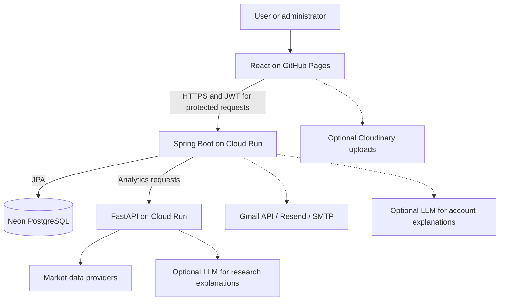
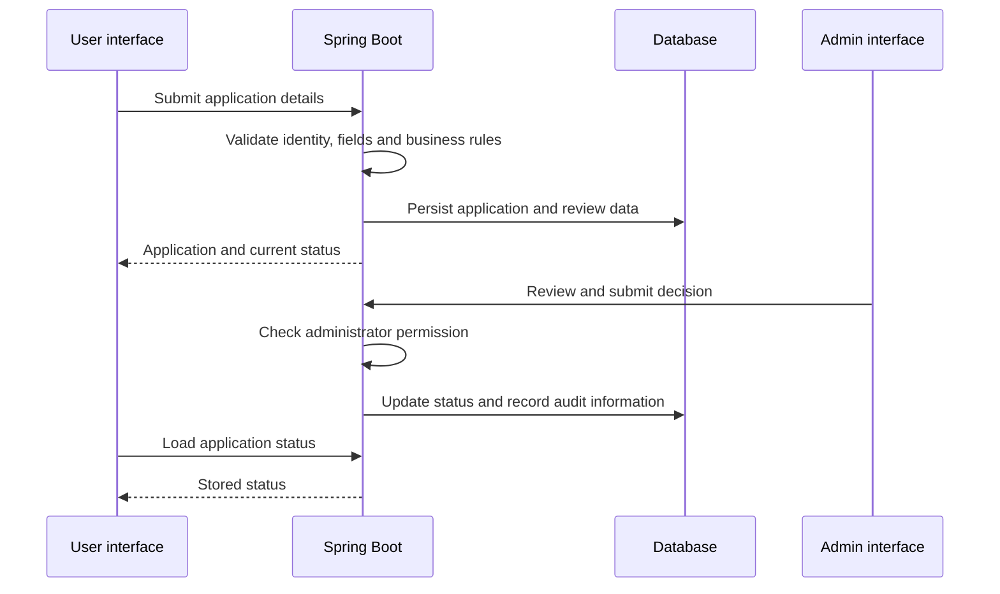
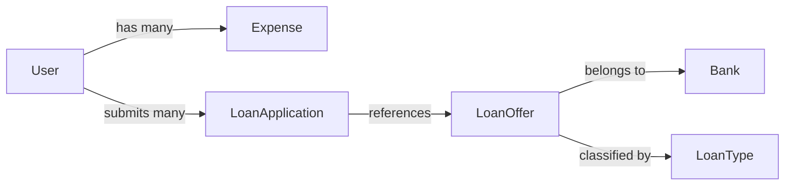

# System design — Loan Verification System

[Back to README](../README.md)

## 1. What the system owns

The application manages users, expenses, loan offers, applications and administrator review. Analytics support these workflows; a model score is not a bank approval or a real disbursement. Payment screens simulate checkout.

## 2. Architecture

| Component | Responsibility |
| --- | --- |
| React | Forms, navigation, charts, status display and API calls |
| Spring Boot | Authentication, authorization, input validation, business rules and persistence |
| Neon PostgreSQL | Durable cloud account and application data |
| FastAPI | Risk signals, expense categorization, forecasts, anomalies and market analytics |
| Notification provider | Deliver configured email/OTP messages |
| Optional LLM | Explain supplied context; does not grant user permissions or approve loans |

Local development uses H2 by default, not Neon. An optional MySQL profile also exists. These are alternative configurations, not three databases required at once.

## 3. Main request flows

### Sign-in and protected actions

1. React submits the sign-in request to Spring Boot.
2. The backend checks credentials and the configured verification flow.
3. Successful authentication returns a JWT.
4. Protected API requests include the token; backend authorization remains the boundary, not hidden frontend buttons.

Public registration creates a user account, not an administrator. Administrator access must be assigned separately.

### Loan application and review

Risk analysis supports the review. The UI must show the stored decision rather than inventing an approval based on the score.

### Expenses and market research

- Expense requests pass through Spring Boot and are associated with the signed-in user. Analytics summarize available data.
- Market requests use the backend market routes and FastAPI. Timestamped snapshots or cached evidence can remain visible when fresh research is unavailable.
- Savings projections are calculations under stated assumptions, not promised returns.

## 4. Core data relationships

Additional entities include `AuditLog` for review activity and `AuthenticatorCredential` for authenticator setup. See the [entity source](../src/main/java/com/loan/VerificationSystem/entity/) for exact fields and constraints.

## 5. Deployment and configuration

| Location | Runs or stores |
| --- | --- |
| GitHub Pages | Static React build; no server-side secrets |
| Cloud Run `fintrack-verification-api` | Java API |
| Cloud Run `fintrack-verification-ai` | Python analytics service |
| Neon | PostgreSQL database |
| Secret Manager | Runtime credentials referenced by deployment scripts |

The [deployment script](../scripts/deploy_google_cloud.sh) configures the two Cloud Run services in `asia-south1`. Review project defaults before reuse. The frontend API base ends in `/api`; `AI_SERVICE_URL` connects the Java backend to Python.

Cloud Run containers are replaceable. Keep durable user records in the database, not container files. Browser-demo storage is a separate mode and does not migrate automatically into Neon.

## 6. Reliability and security

- Keep database, JWT, email and LLM secrets out of frontend builds and Git.
- Use real runtime secrets in production; local defaults are not production credentials.
- A backend health response does not prove email delivery, database workflows or AI calls work. Test those paths separately.
- If an optional provider fails, display the unavailable/fallback state without inventing successful delivery or fresh data.
- Label market snapshots with timestamps and distinguish browser-demo data from backend records.
- Test user ownership and administrator authorization when changing application endpoints.

## 7. Safe verification checklist

1. Check API `/api/users/test` and AI `/health`.
2. Sign in with an existing test account and verify its data loads.
3. Test expense create/read and application submission with test data.
4. Verify admin-only review with an authorized test administrator.
5. Test configured OTP delivery and analytics independently.
6. Run backend tests, frontend tests and the frontend build before publishing changes.

See [setup](SETUP.md), [API documentation](API.md) and [AI service documentation](../ai-fraud-service/README.md) for implementation details.
